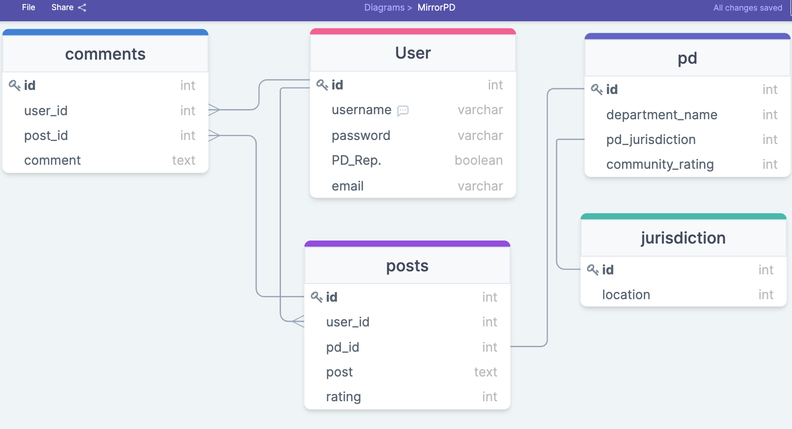

## Database Schema and API Routes

* Police Department:
    - GET /api/department/:id -> Allows users to view a department and the reviews on it.

* Posts
    - POST /api/department/:id/post -> Allows a user to create a post on a department.
    - PUT /api/department/:id/post/:id -> Allows a user to update their post.
    - GET /api/post/:id -> This will all a user to view the post and any comments on it.

* Comments
    - POST /api/posts/:id/comment -> Allows users to add a comment to a post. 
    - PUT /api/posts/:id/comment/:id -> Allows users to update their comment on a post.
    - DELETE /api/posts/:id/comments/:id -> Allows users to delete their comment on a post. 